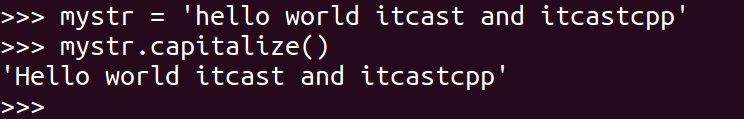
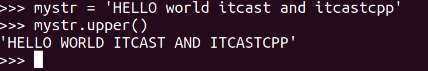
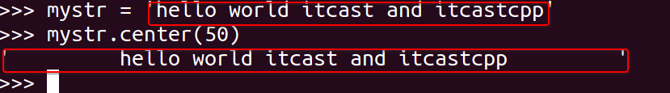
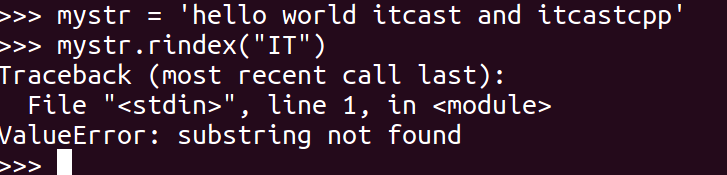

# TASK4

## 列表

### 学习记录

##### 列表的定义和基本使用

```python
# 列表 是python中的一种数据类型，可以存放多种数据，列表中的数据可以是任意不同类型的
# 列表 list，定义使用[]进行定义

# 定义空列表
my_list = []
print(my_list, type(my_list))  # [] <class 'list'>
my_list1 = list()  # 空列表
print(my_list1, type(my_list1))  # [] <class 'list'>
# 定义带数据的列表，数据元素之间使用逗号隔开
my_list2 = [1, 3.14, True, 'isaac']
print(my_list2, type(my_list2))  # [1, 3.14, True, 'isaac'] <class 'list'>
# 求列表中数据元素的个数，即列表的长度
num = len(my_list2)
print(num)  # 4

# 列表支持下标与切片操作
print(my_list2[1])  # 3.14
print(my_list2[-1])  # isaac

print(my_list2[1:3])  # [3.14, True]

# 下标操作和字符串不同的是：字符串不能使用下标修改其中的数据，但是列表可以,且数据类型任意
my_list2[0] = 18
print(my_list2)  # [18, 3.14, True, 'isaac']

my_list2[-1] = 'hello'
print(my_list2)  # [18, 3.14, True, 'hello']

my_list2[0]='python'
print(my_list2)  # ['python', 3.14, True, 'hello']
```

##### 列表的遍历

###### <1>for

###### <2>while

```python
my_list = ['郭德纲', '于谦', '小岳岳', '孙越']

for i in my_list:  # i 就是列表中的每一个数据
    print(i)
# 郭德纲
# 于谦
# 小岳岳
# 孙越

j = 0  # j 表示下标
while j < len(my_list):
    print(my_list[j])
    j += 1
# 郭德纲
# 于谦
# 小岳岳
# 孙越
```

##### 向列表中添加数据的方法

###### <1>append

###### <2>insert

###### <3>extend

```python
# 向列表中添加数据的方法，都是直接在原列表中进行添加的，不会返回新的列表
my_list = ['郭德纲', '于谦', '小岳岳', '孙越']
print(my_list)  # ['郭德纲', '于谦', '小岳岳', '孙越']

# 列表.append(数据) 向列表的尾部追加数据
my_list.append('aa')
print(my_list)  # ['郭德纲', '于谦', '小岳岳', '孙越', 'aa']
result = my_list.append(12)  # 不要这样书写。
print(result)  # None 关键字，表示空
print(my_list)  # ['郭德纲', '于谦', '小岳岳', '孙越', 'aa', 12]

# 列表.insert(下标,数据) 在指定的下标位置进行添加数据
my_list.insert(0, 'isaac')
print(my_list)
# print(my_list.insert(5, 3.14)) 不能这样书写，返回的是None

# 列表.extend(可迭代对象) 会将可迭代对象中的数据逐个添加到原列表的末尾
my_list.extend('hel')
print(my_list)  # ['isaac', '郭德纲', '于谦', '小岳岳', '孙越', 'aa', 12, 'h', 'e', 'l']
my_list.extend([1, 'python', 3])
print(my_list)  # ['isaac', '郭德纲', '于谦', '小岳岳', '孙越', 'aa', 12, 'h', 'e', 'l', 1, 'python', 3]
```

##### 列表中数据查询的操作

###### <1>index

###### <2>count

###### <3>in/not in

```python
my_list = [1, 3.14, 'isaac', False]
# index()  根据数据值，查找元素所在的下标，找到返回元素的下标，没有找到，程序报错
# 列表中没有find方法，只有index()方法
# 查找 3.14 在列表中的下标
num = my_list.index(3.14)
print(num)  # 1

num1 = my_list.index(100)  # 因为数据不存在，程序报错  ValueError: 100 is not in list


# count() 统计出现的次数
num3 = my_list.count(1)
print(num3)  # 1

# in/not in 判断是否存在，存在是True，不存在是False
num4 = 3.14 in my_list
print(num4)  # True

num4 = 3.14 not in my_list
print(num4)  # False
```

##### 列表中的删除操作

###### <1>remove

###### <2>pop

###### <3>del

```python
my_list = [1, 2, 4, 5, 6, 9]

# 1. 根据元素的数据值删除 remove(数据值),直接原列表中的数据
my_list.remove(4)
print(my_list)  # [1, 2, 5, 6, 9]
my_list.remove(4)  # 因为要删除的数据不存在，程序报错 ValueError: list.remove(x): x not in list

# 2. 根据下标删除
# 2.1 pop(下标) 默认删除最后一个数据，返回删除的内容
num = my_list.pop()  # 删除最后一个数据 9
print(num)  # 9
print(my_list)  # [1, 2, 5, 6]
num = my_list.pop(2)  # 删除下标为2的数据 5
print(num)  # 5
print(my_list)  # [1, 2, 6]
my_list.pop(10)  # 删除的下标不存在，报错 IndexError: pop index out of range

# 2.2 del 列表[下标]
del my_list[1:2]  # 删除下标为1~2的数据 2,6
print(my_list)  # [1]
del my_list[10]  # 下标越界，报错 IndexError: list assignment index out of range
```

##### 注

**列表中添加数据，添加的数据后面的数据自动后移**

**列表中删除数据，删除的数据后面的数据自动前移**

##### 列表的排序与逆置

###### <1>sort

###### <2>sorted

###### <3>逆置

```python
# 想要对列表中的数据进行排序，前提是列表中的数据类型是一样的
my_list = [1, 5, 3, 7, 9, 6]

# 列表.sort() 直接在原列表中进行排序
my_list.sort()  # 默认是从小到大排序，即升序
print(my_list)  # [1, 3, 5, 6, 7, 9]
my_list.sort(reverse=True)  # 通过reverse = True,从大到小排序，即降序
print(my_list)  # [9, 7, 6, 5, 3, 1]

# 补充：sorted(列表) 排序，不会在原列表中进行排序，会得到一个新的列表
my_list1 = sorted(my_list)
my_list2 = sorted(my_list, reverse=True)
print(my_list)  # [9, 7, 6, 5, 3, 1]
print(my_list1)  # [1, 3, 5, 6, 7, 9]
print(my_list2)  # [9, 7, 6, 5, 3, 1]

my_list3 = ['a', 'b', 'c', 'd', 'e']
# 逆置
my_list4 = my_list3[::-1]  # 得到一个新的列表
print(my_list3)  # ['a', 'b', 'c', 'd', 'e']
print(my_list4)  # ['e', 'd', 'c', 'b', 'a']

# 在原列表中直接逆置 列表.reverse()
my_list3.reverse()
```

##### 列表的嵌套

```python
school_names = [['北京大学', '清华大学'],
                ['南开大学', '天津大学', '天津师范大学'],
                ['山东大学', '中国海洋大学']]

print(school_names[1])  # ['南开大学', '天津大学', '天津师范大学']
print(school_names[1][1])  # 天津大学
print(school_names[1][1][1])  # 津

for schools in school_names:
    #print(schools)  # 列表
    for name in schools:
        print(name)
北京大学
清华大学
南开大学
天津大学
天津师范大学
山东大学
中国海洋大学
```

##### 案例：分配办公室

一个学校，有3个办公室，现在有8位老师等待工位的分配，请编写程序，完成随机的分配

思路：

1.定义老师及办公室 [][][ [], [], [] ] 

2.定义老师 [ a b ]

3.抓阄，

for 遍历老师列表：

​      抓阄

```python
import random

schools = [[], [], []]  # 三个小列表对应三个办公室，对应的下标是0，1，2
teachers = ['A', 'B', 'C', 'D', 'E', 'F', 'G', 'H']
for teacher in teachers:
    num = random.randint(0, 2)  # randint是唯一一个包含结束位置的方法  产生的随机数相当于是办公室的下标
    schools[num].append(teacher)  # 将老师名字添加到办公室列表中

print(schools)
i = 1
for office in schools:
    print(f'第{i}号办公室老师人数为{len(office)}个，办公室老师的名字：')
    for teacher in office:
        print(teacher, end=' ')
    print()
    i += 1
```


#### **练习题**

##### 1、列表操作练习

列表lst 内容如下

lst = [2, 5, 6, 7, 8, 9, 2, 9, 9]

请写程序完成下列操作：

1. 在列表的末尾增加元素15
2. 在列表的中间位置插入元素20
3. 将列表[2, 5, 6]合并到lst中
4. 移除列表中索引为3的元素
5. 翻转列表里的所有元素
6. 对列表里的元素进行排序，从小到大一次，从大到小一次

```python
lst = [2, 5, 6, 7, 8, 9, 2, 9, 9]
# 1. 在列表的末尾增加元素15
lst.append(15)
print(lst)
# 2. 在列表的中间位置插入元素20
lst.insert((len(lst) + 1) // 2, 20)
print(lst)
# 3. 将列表[2, 5, 6]合并到lst中
lst.extend([2, 5, 6])
print(lst)
# 4. 移除列表中索引为3的元素
lst.pop(3)
print(lst)
# 5. 翻转列表里的所有元素
lst.reverse()
print(lst)
# 6. 对列表里的元素进行排序，从小到大一次，从大到小一次
lst.sort()
print(lst)
lst.sort(reverse=True)
print(lst)

[2, 5, 6, 7, 8, 9, 2, 9, 9, 15]
[2, 5, 6, 7, 8, 20, 9, 2, 9, 9, 15]
[2, 5, 6, 7, 8, 20, 9, 2, 9, 9, 15, 2, 5, 6]
[2, 5, 6, 8, 20, 9, 2, 9, 9, 15, 2, 5, 6]
[6, 5, 2, 15, 9, 9, 2, 9, 20, 8, 6, 5, 2]
[2, 2, 2, 5, 5, 6, 6, 8, 9, 9, 9, 15, 20]
[20, 15, 9, 9, 9, 8, 6, 6, 5, 5, 2, 2, 2]
```

##### 2、修改列表

问题描述：

lst = [1, [4, 6], True]

请将列表里所有数字修改成原来的两倍

```python
lst = [1, [4, 6], True]
lst[0] *= 2
lst[1][0] *= 2
lst[1][1] *= 2
print(lst)

[2, [8, 12], True]
```

##### 3、leetcode 852题 山脉数组的峰顶索引

符合下列属性的数组 arr 称为 山脉数组 ：
arr.length >= 3
存在 i（0 < i < arr.length - 1）使得：
arr[0] < arr[1] < ... arr[i-1] < arr[i]
arr[i] > arr[i+1] > ... > arr[arr.length - 1]

来源：力扣（LeetCode）
链接：https://leetcode-cn.com/problems/peak-index-in-a-mountain-array
著作权归领扣网络所有。商业转载请联系官方授权，非商业转载请注明出处。

示例:

输入：[1, 3, 4, 5, 3]

输出：True

输入：[1, 2, 4, 6, 4, 5]

输出：False

```python
lst = input('读入数组')
# 去除左右[]
lst = lst.strip('[')
lst = lst.strip(']')
# 得到数组
lst.split(',')
lst = [eval(a) for a in lst.split(',')]
Lmax = 0  # 存储从左数碰到的第一个山峰下标
Rmax = 0  # 存储从右数碰到的第一个山峰下标
i = 0
while i < len(lst):
    i += 1
    if lst[i - 1] < lst[i]:
        continue
    else:
        Lmax = i - 1
        break

i = len(lst) - 1
while i > 0:
    i -= 1
    if lst[i] > lst[i + 1]:
        continue
    else:
        Rmax = i + 1
        break
# 若山峰下标相同，输出True，否则为False
if Rmax == Lmax:
    print('True')
else:
    print('False')

```


## 元组

### 学习记录

Python的元组与列表类似，不同之处在于**元组的元素不能修改**。元组使用小括号，列表使用方括号。

###### <x>定义空元组

```python
# 元组和列表非常相似，都可以存放多个数据，可以存放不同数据类型的数据
# 不同点：列表使用[]定义，元组使用()定义
# 列表中的数据可以修改，元组中的数据不能被修改

my_list = [18, 3.14, True, 'isaac']  # 列表

my_tuple = (18, 3.14, True, 'issac')  # 元组
print(my_tuple, type(my_tuple))  # (18, 3.14, True, 'issac') <class 'tuple'>

# 元组支持下标和切片操作
print(my_tuple[1])  # 3.14

# 定义空元组,没有意义
my_tuple1 = ()
my_tuple2 = tuple()
print(my_tuple1, type(my_tuple1))  # () <class 'tuple'>
print(my_tuple2, type(my_tuple2))  # () <class 'tuple'>

# 定义一个数据元素的元组，数据元素后边，必须有一个逗号
my_tuple3 = (3)
print(my_tuple3, type(my_tuple3))  # 3 <class 'int'>
my_tuple4 = (3,)
print(my_tuple4, type(my_tuple4))  # (3,) <class 'tuple'>
```

##### <1>访问元组

元组支持下标与切片操作


##### <2>修改元组


说明： **python中不允许修改元组的数据，包括不能删除其中的元素。**

##### <3>count, index

index和count与字符串和列表中的用法相同

```python
>>> a = ('a', 'b', 'c', 'a', 'b')
>>> a.index('a', 1, 3) # 注意是左闭右开区间
Traceback (most recent call last):
  File "<stdin>", line 1, in <module>
ValueError: tuple.index(x): x not in tuple
>>> a.index('a', 1, 4)
3
>>> a.count('b')
2
>>> a.count('d')
0
```

#### 练习题

##### 1、元组概念

写出下面代码的执行结果和最终结果的类型

```python
(1, 2)*2
(1, )*2
(1)*2
```

分析为什么会出现这样的结果.

```python
print(((1, 2) * 2), type((1, 2) * 2))
print(((1,) * 2), type((1,) * 2))
print(((1) * 2), type((1) * 2))

# (1, 2, 1, 2) <class 'tuple'> (1, 2)作为元组*2
# (1, 1) <class 'tuple'> (1,)作为元组*2
# 2 <class 'int'> (1)的括号被当作运算符，所以(1)被当作整型1，*2后得2
```

##### 2、拆包过程是什么？

```
a, b = 1, 2
```

上述过程属于拆包吗？

说真的，我不知道。但感觉是，因为右边1，2相当一个元组，左边的变量a，b对元组(1，2)解压。而在我现在的猜测里，拆包就是将容器中的数据分别给到不同的变量。所以我觉得是。

可迭代对象拆包时，怎么赋值给占位符？

先通过拆包赋值给变量，然后用变量赋值给占位符。（胡言乱语）

## 字符串

#### 学习记录

#### 字符串

##### 下标（索引）

```python
# 下表也称为是索引，是一个整型数字，可以是正数，也可以是负数
# 正数下标是从0开始的，表示第一个字符，-1表示最后一个字符
my_str = 'hello'
 h   e   l   l   o
 0   1   2   3   4
-5  -4  -3  -2  -1
# 下标的使用语法  变量[下标]
print(my_str[0])  # h
print(my_str[1])  # e

print(my_str[-1])  # o
print(my_str[-3])  # l

# len()函数可以得到字符串的长度
print(len(my_str))  # 5
# 使用正数下标表示字符串最后一个元素
print(my_str[len(my_str)-1])  # o
# 使用负数下标表示字符串最后一个元素
print(my_str[len(my_str)*1])  # o
```

##### 切片

切片是指对操作的对象截取一部分的操作。**字符串、列表、元组**都支持切片操作。

**切片的语法：[起始:结束:步长]**

注意：选取的区间从“起始”位开始，到“结束”**前一位**结束（**不包含结束位本身）**，步长表示选取间隔。

```python
my_str[:]  得到和原来一样的字符串
my_str[::-1]  得到和原来顺序相反的字符串，即字符串的逆置
```

```python
# 切片可以获取一段数据，多个数据；下标（索引）只能获得一个数据
# 切片语法： 变量[start:end:step],会得到一个新的字符串
# start 开始位置的下标
# end 结束位置的下标，不包含end 对应的下标
# step 步长，下标之间的间隔，默认是1
my_str = 'hello'
my_str1 = my_str[2:4:1]  # ll

# step 如果是1，即默认值，可以不写
my_str2 = my_str[2:4]  # ll

# end位置不写，表示是len()，即可以取到最后一个元素
my_str3 = my_str[2:]  # llo

# start 位置也可以省略不写，表示是0，即下标为0的位置开始
my_str4 = my_str[:3]  # hel

# start和end也可以都不写，但是冒号需要写
my_str5 = my_str[:]  # hello

print(my_str[-4:-1])  # ell
print(my_str[3:1])  # 没有数据

# 步长可以是负数
print(my_str[3:1:-1])  # ll

print(my_str[::-1])  # 字符串的逆置，olleh

print(my_str[::2])  # 0 2 4 hlo my_str[0:5:2]
```

#### 字符串常见操作

如有字符串`mystr = 'hello world itcast and itcastcpp'`，以下是常见的操作

##### <1>find&rfind

find()检测 str 是否包含在 mystr中，如果是返回开始的索引值，否则返回-1

```python
my_str = 'hello world itcast and itcastcpp'

# find() 在字符串中查找是否存在某个字符串
# my_str.find(sub_str, start, end)
# sub_str: 要在字符串中查找的内容，类型为str
# start: 开始位置，从哪里开始查找，默认是0
# end: 结束的位置，查找到哪里结束，默认是len()
# 返回值：方法的执行结果是什么，如果找到sub_str，返回sub_str在my_str中的位置的正数下标
# 如果没有找到，返回-1

index = my_str.find('hello')  # 0
print(index)
# 从下标为3的位置，开始查找字符串 hello
print(my_str.find('hello', 3))  # -1
print(my_str.find('itcast'))  # 12
print(my_str.find('itcast', 15))  # 23
# rfind() right find() 从右边（后边）开始查找
print(my_str.rfind('itcast'))  # 23

```


##### <2>index$rindex

index()跟find()方法一样，只不过如果str不在 mystr中会报错。

rindex()跟rfind()一样，只不过找不到子串就报错。

```
mystr.index(str, start=0, end=len(mystr))
```


##### <3>count

返回 str在start和end之间 在 mystr里面出现的次数

```python
# count(sub_str, start, end) 统计出现的次数
print(my_str.count('aaaa'))  # 0
print(my_str.count('hello'))  # 1
print(my_str.count('itcast'))  # 2
print(my_str.count('itcast', 20))  # 1
```


##### <4>replace

把 mystr 中的 str1 替换成 str2,如果 count 指定，则替换不超过 count 次.

```python
# my_str.replace(old_str, new_str, count)  字符串的替换，将 my_str 中的 old_str 替换成 new_str
# old_str：将要被替换的字符串
# new_str：新的字符串，要被替换成的字符串
# count：替换的次数，默认是全部替换
# 返回值：得到一个新的字符串，不会改变原来的字符串

my_str = 'hello world itcast and itcastcpp'

my_str1 = my_str.replace('itcast', 'itheima')

print('my_str :', my_str)  # my_str : hello world itcast and itcastcpp
print('my_str1 :', my_str1)  # my_str1 : hello world itheima and itheimacpp

my_str2 = my_str.replace('itcast', 'itheima', 1)  # 替换一次
print('my_str2 :', my_str2)  # my_str2 : hello world itheima and itcastcpp

```


##### <5>split

以 str 为分隔符切片 my_str，如果 count 有指定值，则仅分隔count次，分隔出 count +1 个子字符串。

也有rsplit，从右分隔

```python
my_str = 'hello world itcast and itcastcpp'

# my_str.split(sub_str, count)  将 my_str 字符串按照 sub_str 进行切割
# sub_str:按照什么内容切割字符串,默认是空白字符，空格，tab键
# count:切割count次，默认是全部切割
# 返回值:列表[]

result = my_str.split()  # 按照空白字符，全部切割
print(result)  # ['hello', 'world', 'itcast', 'and', 'itcastcpp']

print(my_str.split('itcast'))  # ['hello world ', ' and ', 'cpp']
print(my_str.split('itcast', 1))  # 切割一次，['hello world ', ' and itcastcpp']
print(my_str.rsplit('itcast', 1))  # 切割一次，['hello world itcast and ', 'cpp']

```


##### <6>join

将 mystr 插入到 str 中每个元素之间,构造出一个新的字符串

```python
mystr.join(str)

# my_str.join(可迭代对象)
# 可迭代对象：str，列表（join需要列表中的每一个数据都是字符串类型），元组等
# 将 my_str 这个字符串添加到可迭代对象的两个元素之间
# 返回值：一个新的字符串,不会改变原字符串的值

my_str = '_'.join('hello')  # 会把 _ 加入到hello每两个元素之间
print(my_str)  # h_e_l_l_o
print('_*_'.join('hello'))  # h_*_e_*_l_*_l_*_o

# 定义列表
my_list = ['hello', 'cpp', 'python']
print('_'.join(my_list))  # hello_cpp_python
print(' '.join(my_list))  # hello cpp python
```


###### 想一想

（面试题）给定一个字符串aStr，返回使用空格或者'\t'分割后的倒数第二个子串


#### 字符串常用操作(课外阅读)

##### <1>capitalize

把字符串的第一个字符大写

```
mystr.capitalize()
```



##### <2>title

把字符串的每个单词首字母大写

```python
>>> a = "hello itcast"
>>> a.title()
'Hello Itcast'
```

##### <3>startswith

检查字符串是否是以 hello 开头, 是则返回 True，否则返回 False

```
mystr.startswith(hello)
```


##### <4>endswith

检查字符串是否以obj结束，如果是返回True,否则返回 False.

```
mystr.endswith(obj)
```


##### <5>lower

转换 mystr 中所有大写字符为小写

```
mystr.lower()        
```


##### <6>upper

转换 mystr 中的小写字母为大写

```
mystr.upper()
```



##### <7>ljust

返回一个原字符串左对齐,并使用空格填充至长度 width 的新字符串

```
mystr.ljust(width)
```


##### <8>rjust

返回一个原字符串右对齐,并使用空格填充至长度 width 的新字符串

```
mystr.rjust(width)
```


##### <9>center

返回一个原字符串居中,并使用空格填充至长度 width 的新字符串

```
mystr.center(width)   
```



##### <10>lstrip

删除 mystr 左边的空白字符

```
mystr.lstrip()
```


##### <11>rstrip

删除 mystr 字符串末尾的空白字符

```
mystr.rstrip()
```


##### <12>strip

删除mystr字符串两端的空白字符

```python
>>> a = "\n\t itcast \t\n"
>>> a.strip()
'itcast'
```

##### <13>rfind

类似于 find()函数，不过是从右边开始查找.

```
mystr.rfind(str, start=0,end=len(mystr) )
```


##### <14>rindex

类似于 index()，不过是从右边开始.

```
mystr.rindex( str, start=0,end=len(mystr))
```



##### <15>partition

把mystr以str分割成三部分,str前，str和str后

```
mystr.partition(str)
```


##### <16>rpartition

类似于 partition()函数,不过是从右边开始.

```
mystr.rpartition(str)
```


##### <17>splitlines

按照行分隔，返回一个包含各行作为元素的列表

```
mystr.splitlines()  
```


##### <18>isalpha

如果 mystr 所有字符都是字母 则返回 True,否则返回 False

```
mystr.isalpha()  
```


##### <19>isdigit

如果 mystr 只包含数字则返回 True 否则返回 False.

```
mystr.isdigit()
```


##### <20>isalnum

如果 mystr 所有字符都是字母或数字则返回 True,否则返回 False

```
mystr.isalnum()  
```


##### <21>isspace

如果 mystr 中只包含空格，则返回 True，否则返回 False.

```
mystr.isspace()   
```


#### 练习题

##### 1、字符串函数回顾

- 怎么批量替换字符串中的元素？

  使用方法replace，`string.replace(old_str, new_str, count)` 

- 怎么把字符串按照空格进⾏拆分？

  使用方法spilt，`string.spilt( )`

- 怎么去除字符串⾸位的空格？

  使用方法lstrip，`string.lstrip()`

##### 2、实现isdigit函数

题目要求

实现函数isdigit， 判断字符串里是否只包含数字0~9

```python
def isdigit(string):
    for i in string:
        if not (0 <= eval(i) <= 9):
            bool1 = False
            break
    else:
        bool1 = True
    return bool1
# 我还没写学到函数，我不知道函数格式是啥样的，先这样写着
```

##### 3、leetcode 5题 最长回文子串

给定一个字符串 `s`，找到 `s` 中最长的回文子串。你可以假设 `s` 的最大长度为 1000。

示例:

输入: "babad"

输出: "bab"

输入: "cbbd"

输出: "bb"

```python
s = input('输入一个字符串:')
s1 = s2 = s[0]
for i in range(0, len(s) - 2):
    if s[i - 1] == s[i + 1]:
        # len2 = 3
        for j in range(i - 1, -1, -1):
            if len(s) - len(s2) >= 2:
                if s[j] == s[2 * i - j]:
                    # len2 += 2
                    s2 = s[j:2 * i - j + 1]
                else:
                    break
for i in range(0, len(s) - 2):
    if 2 * i < len(s):
        if s[i] == s[i + 1]:
            # len1 = 2
            for j in range(i - 1, -1, -1):
                if s[j] == s[2 * i - j + 1]:
                    # len1 += 2
                    s1 = s[j:2 * i - j + 2]
                else:
                    break
if len(s1) > len(s2):
    print(s1)
else:
    print(s2)

```

